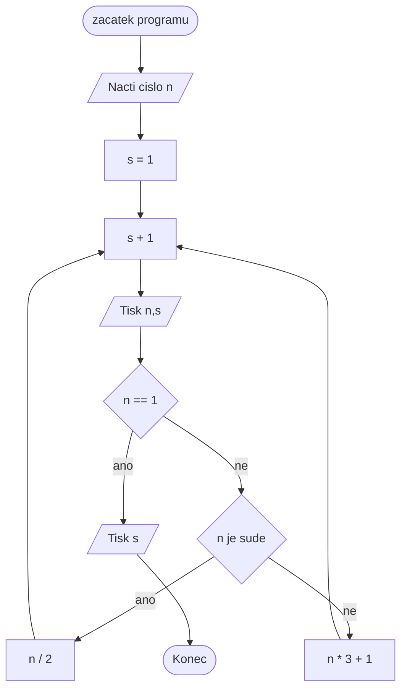

```mermaid
flowchart TD
    input[/Nacti cislo n/]
    output[/Tisk s/]
    start([zacatek programu])
    even[n / 2]
    odd[n * 3 + 1]
    if{n je sude}
    n{n == 1}
    stop([Konec])
    init[s = 1]
    count[s + 1]
    print[/Tisk n,s/]

    start --> input
    input --> init --> count --> print --> n
    
    if -- ano --> even
    if -- ne --> odd
    n -- ne -->if
    even --> count
    odd --> count
    n -- ano --> output --> stop
```