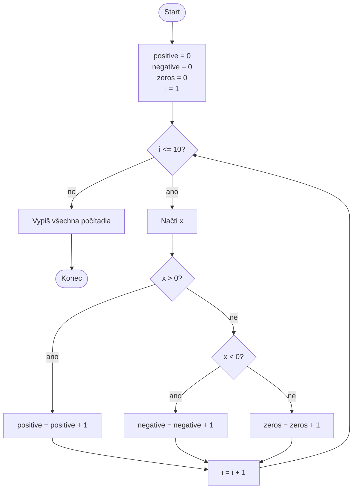

```mermaid
flowchart TD
    start([Start]) --> init["positive = 0<br/>negative = 0<br/>zeros = 0<br/>i = 1"]
    init --> loop{"i <= 10?"}
    loop -- ne --> output["Vypiš všechna počítadla"]
    output --> stop([Konec])
    loop -- ano --> read["Načti x"]
    read --> positive{"x > 0?"}
    positive -- ano --> addPositive["positive = positive + 1"]
    positive -- ne --> negative{"x < 0?"}
    negative -- ano --> addNegative["negative = negative + 1"]
    negative -- ne --> addZero["zeros = zeros + 1"]
    addPositive --> increment["i = i + 1"]
    addNegative --> increment
    addZero --> increment
    increment --> loop
```