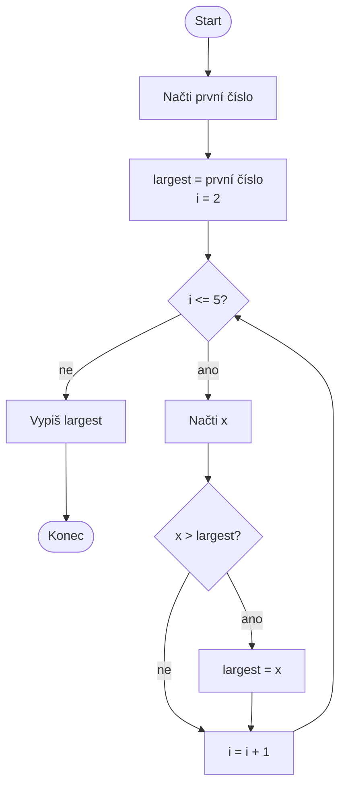

```mermaid
flowchart TD
    start([Start]) --> first["Načti první číslo"]
    first --> init["largest = první číslo<br/>i = 2"]
    init --> loop{"i <= 5?"}
    loop -- ne --> output["Vypiš largest"]
    output --> stop([Konec])
    loop -- ano --> read["Načti x"]
    read --> compare{"x > largest?"}
    compare -- ano --> replace["largest = x"]
    compare -- ne --> increment["i = i + 1"]
    replace --> increment
    increment --> loop
```