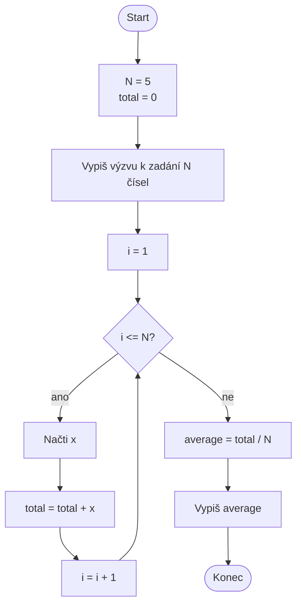

```mermaid
flowchart TD
    start([Start]) --> init["N = 5<br/>total = 0"]
    init --> prompt["Vypiš výzvu k zadání N čísel"]
    prompt --> setI["i = 1"]
    setI --> loop{"i <= N?"}
    loop -- ano --> read["Načti x"]
    read --> add["total = total + x"]
    add --> increment["i = i + 1"]
    increment --> loop
    loop -- ne --> average["average = total / N"]
    average --> output["Vypiš average"]
    output --> stop([Konec])
```