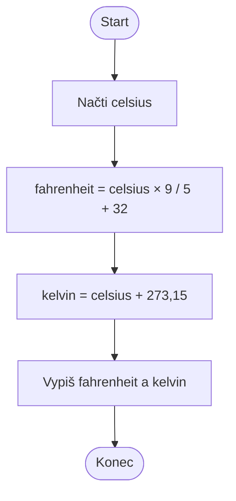

```mermaid
flowchart TD
    start([Start]) --> read["Načti celsius"]
    read --> fahrenheit["fahrenheit = celsius × 9 / 5 + 32"]
    fahrenheit --> kelvin["kelvin = celsius + 273,15"]
    kelvin --> output["Vypiš fahrenheit a kelvin"]
    output --> stop([Konec])
```