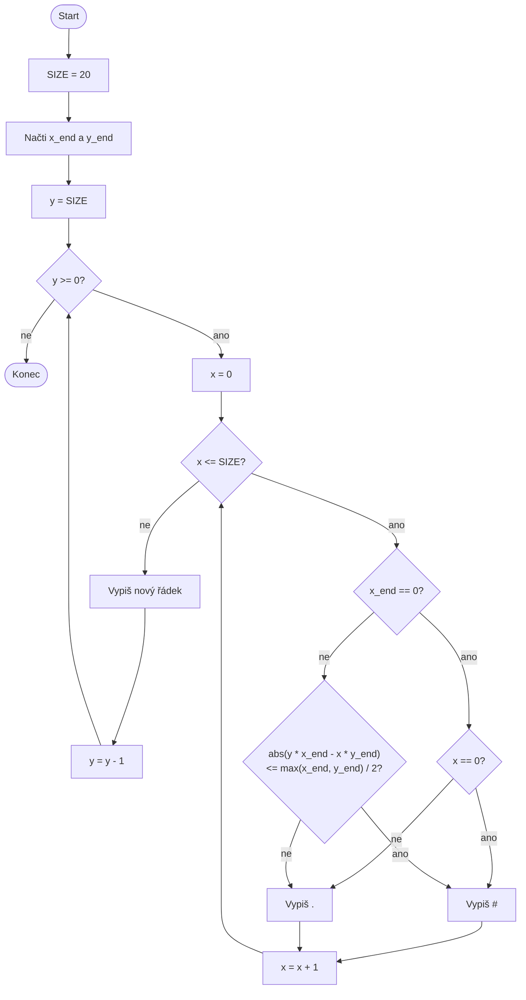

```mermaid
flowchart TD
    start([Start]) --> init["SIZE = 20"]
    init --> input["Načti x_end a y_end"]
    input --> setY["y = SIZE"]
    setY --> outer{"y >= 0?"}
    outer -- ne --> stop([Konec])
    outer -- ano --> setX["x = 0"]
    setX --> inner{"x <= SIZE?"}
    inner -- ne --> newline["Vypiš nový řádek"]
    newline --> decrementY["y = y - 1"]
    decrementY --> outer
    inner -- ano --> vertical{"x_end == 0?"}
    vertical -- ano --> onAxis{"x == 0?"}
    onAxis -- ano --> hash["Vypiš #"]
    onAxis -- ne --> dot["Vypiš ."]
    vertical -- ne --> nearLine{"abs(y * x_end - x * y_end)<br/><= max(x_end, y_end) / 2?"}
    nearLine -- ano --> hash
    nearLine -- ne --> dot
    hash --> incrementX["x = x + 1"]
    dot --> incrementX
    incrementX --> inner
```